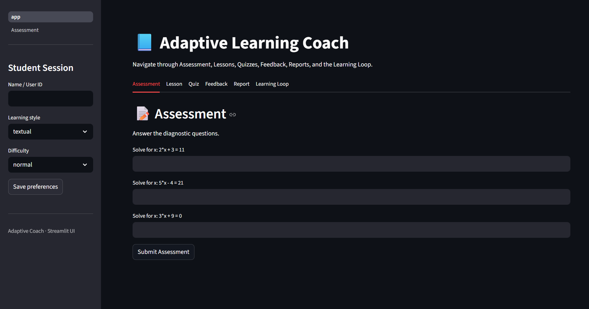
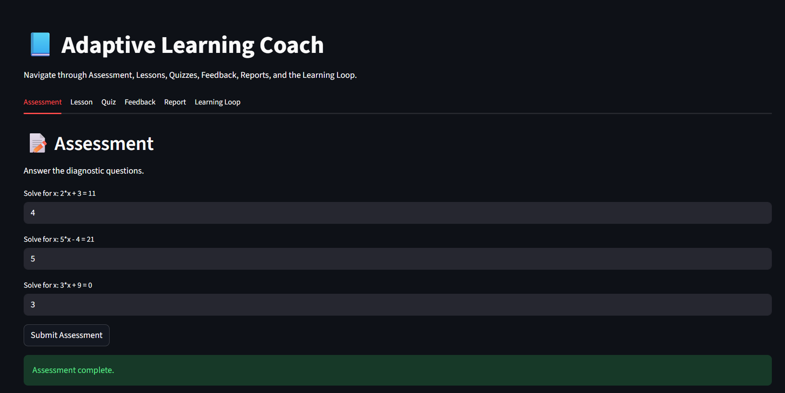
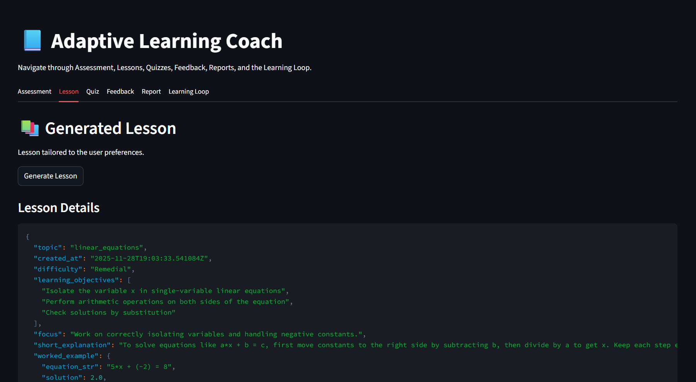
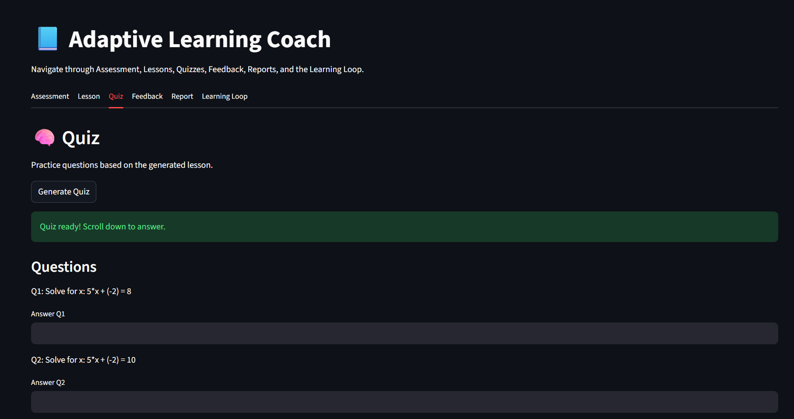
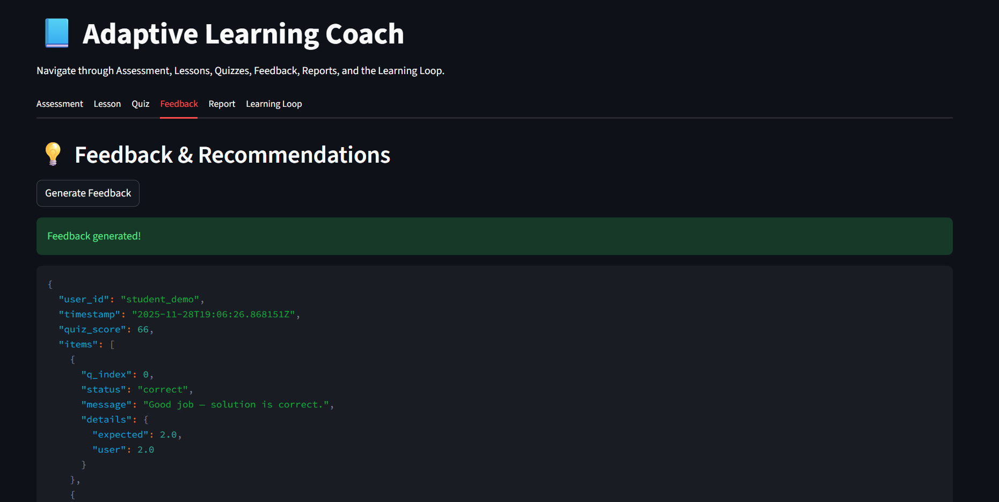
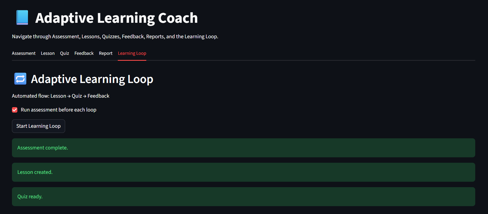
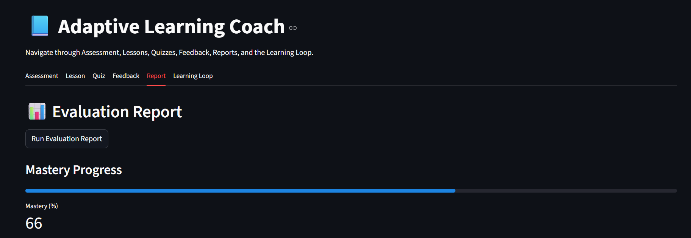

# 📘 Adaptive Learning Coach (Multi-Agent Personalized Tutoring System)

## 🎯 Problem

Traditional online math-learning platforms treat every student the same. They do not detect misconceptions, do not track long-term progress, and do not adapt lessons based on mistakes. Students repeat the same errors without understanding *why* they are incorrect, which leads to frustration, reduced confidence, and loss of motivation.

Students need a tutor that **remembers their past performance, adapts instruction to their level, and closes learning gaps—not a one-size-fits-all experience.**

---

## 💡 Solution

Adaptive Learning Coach is an AI-powered personalized tutor built using a **multi-agent orchestration system**. Instead of relying on a single model, it uses multiple agents—each with a specialized responsibility—to deliver a complete, self-improving learning experience.

After every lesson, quiz, and feedback cycle, the system updates the student’s **memory and mastery score** to tailor the next lesson. This creates an uninterrupted loop of improvement.

### Why it works

| Challenge in learning              | How Adaptive Learning Coach solves it               |
| ---------------------------------- | --------------------------------------------------- |
| Students forget or repeat mistakes | System remembers performance and adapts dynamically |
| Lessons are generic                | Lessons are auto-generated based on weaknesses      |
| Exams give marks but no learning   | Feedback explains step-by-step reasoning            |
| Fixed curriculum                   | Difficulty evolves as mastery increases             |

---

## 🌍 User Interface Preview

| Page                  | Screenshot                             |
| --------------------- | -------------------------------------- |
| **Home / Sidebar**    |               |
| **Assessment Page**   |    |
| **Lesson Generation** |  |
| **Quiz Interface**    |     |
| **Feedback Page**     |      |
| **Learning Loop**     |      |
| **Evaluation Report** |  |

---

## 🚀 Demo

Run the interactive Streamlit interface:

```bash
streamlit run streamlit_app/app.py
```

Or explore the demonstration notebook:

```
notebooks/demo.ipynb
```

---

## 🧠 System Architecture

```
 Assessment Agent → Lesson Agent → Quiz Agent → Feedback Agent
                         ↑              ↓
                    Memory Bank ← Mastery Tracking
```

The **Learning Loop tab** automates this process so the student stays in a continuous improvement cycle.

---

## ✨ Key Agentic Features (Rubric-Aligned)

| Feature Category                    | How it is implemented                                       |
| ----------------------------------- | ----------------------------------------------------------- |
| **Multi-Agent System**              | 4 autonomous agents: Assessment, Lesson, Quiz, Feedback     |
| **Sequential Agents**               | Assessment → Lesson → Quiz → Feedback pipeline              |
| **Loop Agent**                      | Continuous personalized learning cycle                      |
| **Sessions & Memory**               | SQLite memory stores lessons, quizzes, mastery, preferences |
| **Long-Term Memory**                | Mastery continuously updated and used to adjust difficulty  |
| **Observability (Logging/Tracing)** | Implemented through OpenTelemetry                           |
| **Agent Evaluation**                | Reports generated via `evaluation_report()`                 |
| **Agent Deployment**                | Exposed through a polished Streamlit app                    |

This project demonstrates **far more than the required 3 agentic concepts**.

---

## 📂 Project Structure

```
adaptive-coach/
│
├── agents/
│   ├── assessment_agent.py
│   ├── lesson_agent.py
│   ├── quiz_agent.py
│   └── feedback_agent.py
│
├── memory/
│   ├── db.py
│   ├── memory.py
│   └── evaluation.py
│
├── streamlit_app/
│   └── app.py
│
├── notebooks/
│   └── demo.ipynb
│
├── api.py
├── requirements.txt
└── README.md
```

---

## 🧩 How the Agents Work

| Agent                | Responsibilities                                             |
| -------------------- | ------------------------------------------------------------ |
| **Assessment Agent** | Diagnoses initial skill level using a short problem set      |
| **Lesson Agent**     | Designs a micro-lesson with worked example and focus areas   |
| **Quiz Agent**       | Generates practice questions and grades them                 |
| **Feedback Agent**   | Explains mistakes step-by-step using deterministic reasoning |

---

## 🔄 Adaptive Learning Loop

The **Learning Loop tab** automates student progression:

1. (Optional) Assessment
2. Lesson generation
3. Quiz creation
4. Quiz grading
5. Feedback & mastery update
6. New adaptive lesson is generated
7. Cycle continues

This produces **continuous and personalized skill improvement**.

---

## 📊 Memory & Progress Tracking

Memory is stored per student and includes:

| Data Stored   | Purpose                         |
| ------------- | ------------------------------- |
| last_lesson   | Resume where learning paused    |
| last_quiz     | Recover incomplete quiz         |
| quiz history  | Skill improvement tracking      |
| topic_mastery | Adaptive difficulty progression |
| preferences   | Personalized teaching style     |

This enables **consistent and persistent learning across sessions**.

---

## 🛠 Installation

```bash
git clone <repo>
cd adaptive-coach
pip install -r requirements.txt
```

Start the app:

```bash
streamlit run streamlit_app/app.py
```

---

## 📌 Requirements

```
streamlit
sympy
rich
opentelemetry-api
opentelemetry-sdk
python-dotenv
jupyter
plotly
requests
pandas
```

---

## 🧪 Testing (quick)

Start a session:

```
Assessment → Lesson → Quiz → Feedback → Report
```

or run the **Learning Loop** and progress will update automatically.

---

## 🙌 Acknowledgment

This project was created for the **5-Day AI Agents Intensive Course with Google × Kaggle**, demonstrating:

* multi-agent orchestration
* sequential and loop agent control
* persistent memory and mastery adaptation
* observability via logging and tracing
* agent evaluation via mastery reports

---

